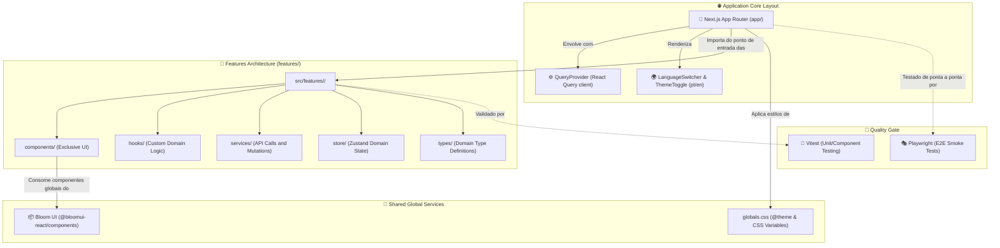

<div align="center">
  <br/>
  <br/>
  
  <br/>
  <br/>
  <p>
    🇺🇸 <a href="./README.en.md">English Version</a> | 🇧🇷 <strong>Versão em Português</strong>
  </p>
</div>

<br />

## 🌟 Visão Geral

O **Nexus** é um boilerplate profissional de alta performance e fortemente tipado projetado para o desenvolvimento de sistemas complexos e aplicações web escaláveis. Desenvolvido sobre o ecossistema do React 19 e Next.js 16 (App Router), o template vem pré-configurado com a biblioteca de componentes **Bloom UI**, gerenciamento de estado leve com **Zustand**, sincronização e cache de servidor via **TanStack Query** e formulários validados com **React Hook Form + Zod**.

Toda a arquitetura é estruturada de forma modular orientada a **Features/Módulos**, facilitando a manutenção e garantindo a consistência completa de temas claro/escuro e acessibilidade nativa.

---

## 📦 Instalação & Uso via CLI

<div align="center">
  <a href="https://github.com/guibus-nexus/create-nexus">
    
  </a>
  <a href="https://www.npmjs.com/package/@guibus-nexus/create-nexus">
    
  </a>
</div>

<br />

Você pode criar um novo projeto baseado neste boilerplate instantaneamente utilizando o inicializador CLI oficial do Nexus:

```bash
# Inicialize um novo projeto baseado no Nexus
pnpm create @guibus-nexus/nexus meu-sistema
# ou
npm create @guibus-nexus/nexus meu-sistema
```

### Comandos de Desenvolvimento

Após criar seu projeto e acessar o diretório, utilize os scripts abaixo para gerenciar a aplicação:

```bash
# Instale as dependências
pnpm install

# Inicie o servidor de desenvolvimento
pnpm dev

# Realize a validação estática de tipos
pnpm typecheck

# Execute a suíte de testes unitários (Vitest)
pnpm test

# Execute a suíte de testes E2E (Playwright)
pnpm test:e2e

# Realize a compilação otimizada para produção
pnpm build
```

---

## 🛠️ Stack Tecnológica

<div align="center">
  
  
  
  
  
  
  
  
  
  
  
  
  
  
  
</div>

---

## 🏛️ Arquitetura do Sistema

O Nexus adota o design orientado a **Features (Recursos)** para garantir o isolamento e modularização lógica de cada domínio de negócio:



---

## 🧪 Testes & Integração

O ecossistema adota uma cobertura robusta de testes para garantir que alterações na lógica e layouts não causem regressões em produção:

```bash
# Rodar todos os testes de unidade e componentes com Vitest
pnpm test

# Rodar todos os testes E2E com Playwright
pnpm test:e2e
```

---

## 🧹 Script de Limpeza (Strip Comments)

Para manter o código-fonte de produção o mais clean possível e livre de comentários desnecessários, o Nexus fornece um script automatizado de limpeza:

```bash
# Remove comentários de linha única (//), multilinha (/* */) e JSX ({/* */}) no diretório src/
pnpm strip
```
